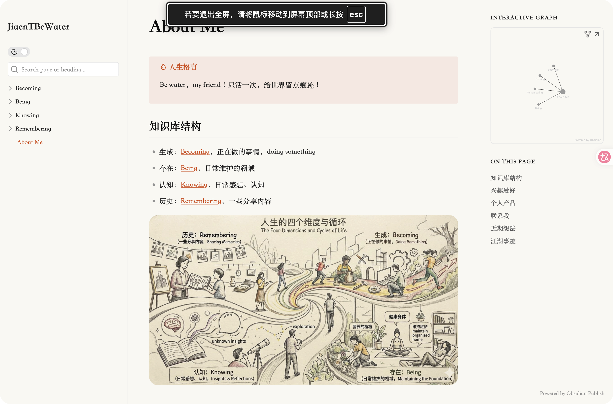

# JTClaude

A minimal Obsidian theme inspired by Claude's interface design.

**Supports both Light and Dark mode.**

**Live demo:** [jiaentbewater](https://publish.obsidian.md/jiaentbewater)

Light Mode

Dark Mode

## Features

- Warm beige background inspired by Claude's chat interface
- Claude orange-copper accent color (`#CF6530`)
- Serif font (Noto Serif SC) for a clean reading experience
- Consistent styling for callouts, blockquotes, and lists
- Full dark mode support (follows system preference + manual toggle)
- Compatible with **Obsidian Publish** — just copy `theme.css` as `publish.css`

## Installation

### Manual

1. Download `theme.css` and `manifest.json`
2. Create a folder `JTClaude` in your vault's `.obsidian/themes/` directory
3. Place both files inside
4. Open Obsidian → Settings → Appearance → Themes → select **JTClaude**

### Obsidian Publish

Copy `theme.css` to your vault root and rename it to `publish.css`, then publish it.

## Colors

| Role | Light | Dark |
|------|-------|------|
| Background | `#FAF9F5` | `#2A2825` |
| Sidebar | `#F0EDE6` | `#1C1A18` |
| Text | `#2D2D2D` | `#EBEBEB` |
| Accent | `#CF6530` | `#D97757` |

## Changelog

### v1.0.0
- Initial release
- Light & dark mode support
- Callout, blockquote, list styling
- Obsidian Publish compatible

## License

MIT
